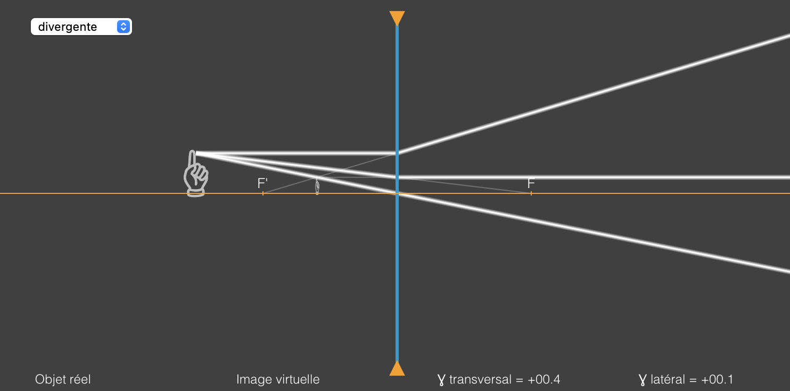

# lens-simulator
P5.js sketch to illustrate the formation of images by lens using the technique of ray tracking.
The simulation compute the transverse and longitudinal magnification.

## screenshot

